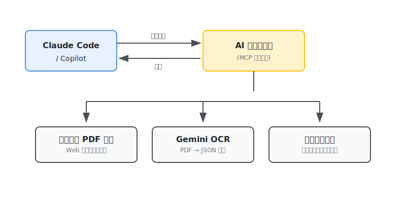

<!-- _class: lead -->
<!-- _paginate: false -->

# 日々の食事にこだわりを!

## あいランチ🍱のメニュー選び・注文の手間を
## **AI ランチくん🤖** で解決!

---

# 自己紹介

<!-- ここに自己紹介を書く -->

---

# あいランチとは

福井県内に展開している、企業・団体向けの **すみよしのお弁当注文・配達サービス**

- 毎日 2 種類のメニューから選べる
  - **あいランチ**: 洋風メニュー中心
  - **和風ランチ**: 魚料理など和食中心
- Web システムから事前注文


---

# 困っていたこと

## メニュー選びが手間...

| 課題 | 詳細 |
|-----|------|
| **ページが分離** | メニュー掲載と注文システムが別サイト |
| **PDF が見づらい** | 毎回 PDF を開いて確認するのが面倒 |
| **注文が手間** | 1 日ずつ Web でポチポチ... |

---

<!-- _class: lead -->

# 理想の姿

## 「明日のあいランチ頼んで」

### で注文完了したい!

---

# 作ったもの: AI ランチくん

**MCP サーバー** として実装し、Claude や Copilot から自然言語で操作

```
👤 明日のランチメニュー教えて

🤖 📅 2026-02-16 のランチメニュー
   🍱 あいランチ: ハムベーコンフライ, 切干大根煮, ...
   🐟 和風ランチ: ブリの漬け焼き, ...

👤 あいランチを1つ注文して

🤖 ✅ 2026-02-16 の あいランチ を 1 個注文しました。
```

---

# システム構成



---

# 工夫 1: Gemini API で PDF を読み取り

## 従来の OCR ライブラリでは精度が出なかった

| 従来 OCR | Gemini API |
|---------|------------|
| 文字を認識するだけ | **見て、理解して、構造化** |
| レイアウト情報が失われる | 表の構造を理解できる |
| 後処理が大変 | JSON で直接出力 |

---

# 工夫 1: Gemini API で PDF を読み取り

## プロンプトで指示するだけで構造化 JSON に変換

```python
PROMPT = """
この PDF はランチメニュー表です。
全ての日付について、あいランチと和風ランチの情報を抽出し、
以下のフォーマットの JSON 配列で出力してください。

ルール:
- 土曜・日曜・祝日のメニューは含めないでください。
"""
```

→ **「土日除外」も理解してくれる!**

---

# 工夫 2: MCP で自然言語操作

## コマンドを覚えなくていい!

```
❌ lunch-bot order --date 2026-02-16 --menu ai --qty 1

⭕ 「明日のあいランチ頼んで」
```

**表記ゆれも吸収**

| ユーザー入力 | 内部処理 |
|-------------|---------|
| 和風 / 和風ランチ / wafu | → `0` |
| あい / あいランチ / ai | → `1` |
| 明日 / あした / 2/16 | → `2026-02-16` |

---

# 工夫 3: セッション管理で快適に

## 毎回ログインするとボット判定されてしまう問題

**解決策**: Cookie を保存して再利用

```
初回: ログイン → Cookie 保存
2回目以降: 保存した Cookie で認証スキップ
```

ブラウザに近い HTTP ヘッダーも設定してボット検知を回避

---

# 工夫 4: メニューの自動更新

## 「来週のメニューは?」と聞かれたとき...

```
メニューデータにない
    ↓
自動で PDF をダウンロード
    ↓
Gemini OCR で JSON 化
    ↓
回答
```

**ユーザーは意識せず最新メニューを取得できる**

---

# 提供している MCP ツール

| ツール | 機能 |
|-------|------|
| `get_lunch_menu` | 日付指定でメニュー取得 |
| `search_menu` | 「フライ」「魚」でキーワード検索 |
| `list_all_menus` | 全メニュー一覧表示 |
| `place_order` | 注文実行 |
| `cancel_order` | 注文取り消し |
| `get_order_status` | 今月の注文状況確認 |

---

# デモ

<!-- 実際にデモする場合はここに手順を書く -->

```bash
# Claude Code で使う場合
cd ai-lunch-bot
claude

# 話しかけるだけ
> 明日のメニュー教えて
> フライがある日はいつ?
> 明日のあいランチを注文して
```

---

# 技術スタック

| 領域 | 技術 |
|-----|------|
| MCP サーバー | FastMCP (Python) |
| OCR | Google Gemini 2.5 Flash |
| HTTP クライアント | httpx |
| スクレイピング | BeautifulSoup4 |

---

<!-- _class: lead -->

# まとめ

---

# まとめ

## AI ランチくんで実現したこと

- **メニュー確認**: PDF を開かず自然言語で質問
- **検索**: 「魚が食べたい」→ 該当日を検索
- **注文**: 「明日のあいランチ頼んで」で完了
- **確認**: 「今月の注文状況は?」で一覧表示

## 毎日のランチ選びが少し楽しくなりました!

---

<!-- _class: lead -->
<!-- _paginate: false -->

# ご清聴ありがとうございました!

**リポジトリ**: [https://github.com/MisonoTakezo/ai-lunch-bot](https://github.com/MisonoTakezo/ai-lunch-bot)

